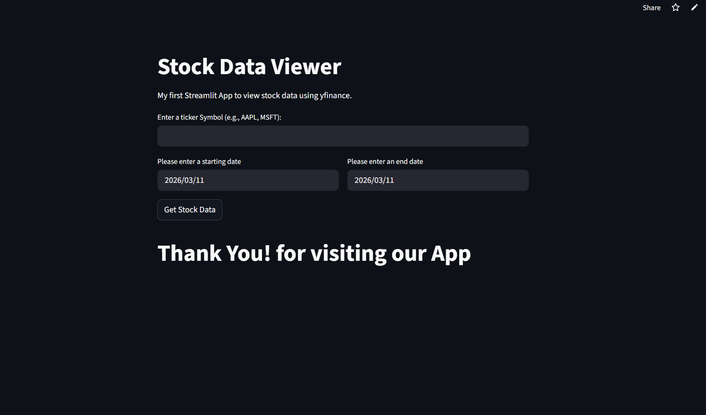
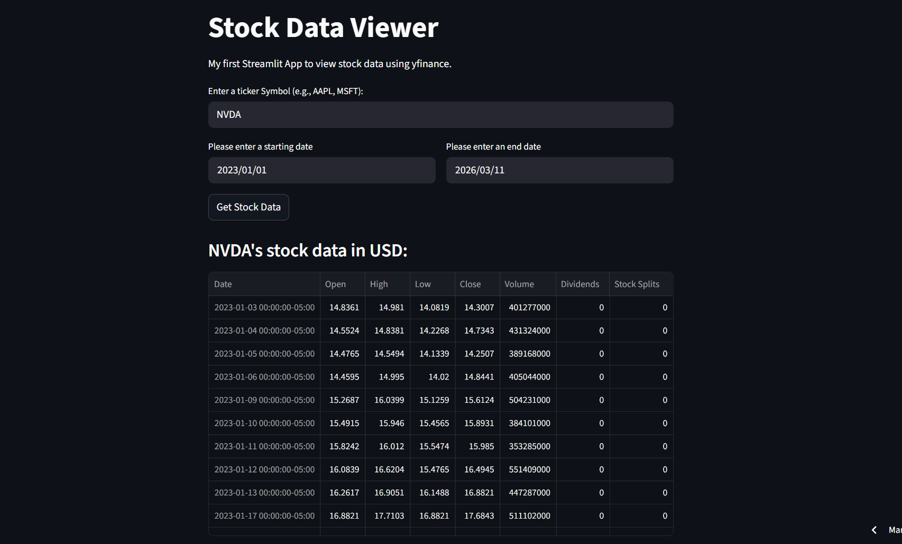
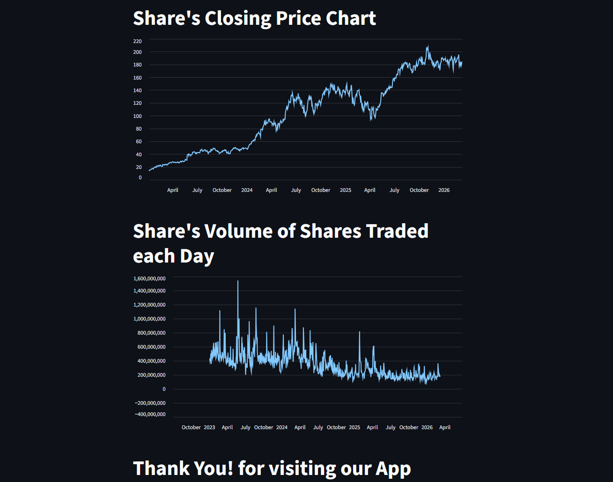

<h1 align="center">📈 Stock Data Viewer – Streamlit App</h1>

A simple and interactive web application to view historical stock market data using Python and Streamlit.

<h2>📌 Project Overview</h2>

<strong>Stock Data Viewer</strong> is a beginner-friendly data analytics project built using <strong>Streamlit</strong>.
The application allows users to fetch and visualize historical stock market data in an interactive way.

Users can enter a stock ticker symbol, select a date range, and instantly visualize stock data using charts.
The project helped me understand how to work with APIs, handle user inputs, and build data-driven web applications.

<h2>🚀 Live Demo</h2>

🔗 <strong>Live Application:</strong> 

<a href="https://stock-viewer-kuldeep.streamlit.app/" target="_blank">
https://stock-viewer-kuldeep.streamlit.app/
</a>

<h2>🛠️ Tools & Technologies Used</h2>

<strong>Python • Streamlit • Pandas • yfinance • Data Visualization</strong>

<h2>🔍 Features</h2>

<ul>
<li>📊 Fetch historical stock market data</li>
<li>🔎 Enter any stock ticker (AAPL, MSFT, TSLA, etc.)</li>
<li>📅 Select custom start and end dates</li>
<li>🖱️ Data loads only after button click</li>
<li>📈 Closing price visualization</li>
<li>📉 Trading volume visualization</li>
<li>📋 Display stock data in table format</li>
</ul>

<h2>📷 Application Screenshots</h2>

<h3>1️⃣ Application Overview</h3>

User interface where users can enter a stock ticker symbol and select the date range.

 

<h3>2️⃣ Stock Data Display (DataFrame)</h3>

The application displays the fetched stock data in a structured table using a Pandas DataFrame.

 

<h3>3️⃣ Stock Price & Volume Charts</h3>

Interactive charts showing the closing price trend and daily trading volume.

<h2>⚙️ How to Run the Project</h2>

<h3>1️⃣ Clone the Repository</h3>

<pre>
git clone https://github.com/yourusername/stock-data-viewer.git
cd stock-data-viewer
</pre>

<h3>2️⃣ Install Required Libraries</h3>

<pre>
pip install streamlit yfinance pandas
</pre>

<h3>3️⃣ Run the Streamlit App</h3>

<pre>
streamlit run app.py
</pre>

<h3>4️⃣ Open in Browser</h3>

Streamlit will automatically open the application in your browser.

<h2>📊 Project Workflow</h2>

<ol>
<li>User enters a stock ticker symbol</li>
<li>User selects start and end date</li>
<li>Click <strong>Get Stock Data</strong> button</li>
<li>App fetches stock data using <strong>yfinance</strong></li>
<li>Data is displayed in a table</li>
<li>Charts show closing price and trading volume</li>
</ol>

<h2>🎯 Learning Outcomes</h2>

<ul>
<li>Building interactive apps using Streamlit</li>
<li>Working with financial data APIs</li>
<li>Handling user inputs in Python</li>
<li>Data visualization for time-series data</li>
<li>Deploying Streamlit applications</li>
</ul>

<h2>⚠️ Notes</h2>

<ul>
<li>Make sure the ticker symbol is valid</li>
<li>Start date must be earlier than the end date</li>
<li>This project is created for learning and educational purposes</li>
</ul>

<h2>👨‍💻 Author</h2>

<strong>Kuldeep Rathore</strong>

🔗 LinkedIn: 

<a href="https://www.linkedin.com/in/kuldeeprathore9440">
www.linkedin.com/in/kuldeeprathore9440
</a>

<h2>🙌 Feedback</h2>

Feedback, suggestions, and improvements are always welcome.
This project is part of my learning journey in <strong>Data Analytics, AI, and Machine Learning</strong>.

⭐ If you like this project, consider giving it a star on GitHub!

